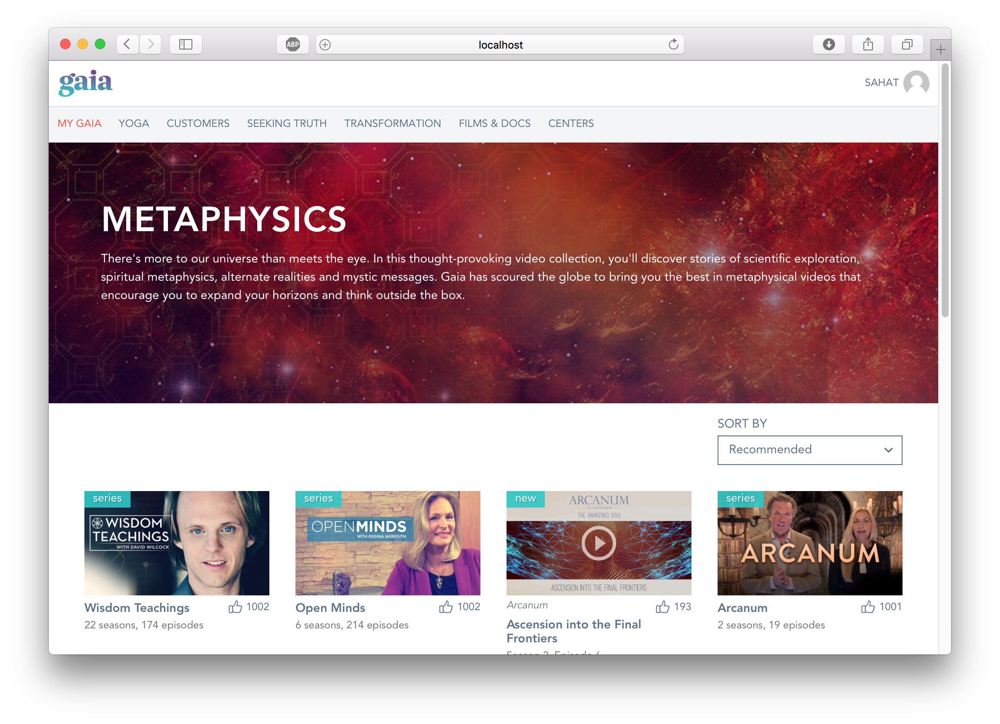

# Gaia Demo App

Demo app built using the latest tools like React, Redux, ES6, Webpack, Enzyme, Mocha, Chai.

## Getting started

1. Clone repository `https://github.com/sahat/gaia000.git`
2. Enter project directory `cd gaia000`
3. Install dependencies `npm install`

## Scripts

All scripts are run with `npm run [script]`, for example: `npm run test`.

* `start` - start development server, try it by opening `http://localhost:3000/`
* `test` - run all tests (with Mocha, Enzyme and Chai)

# Tests

All unit tests are located in the `test` directory, categorized by Redux type, e.g. `actions`, `components`.
